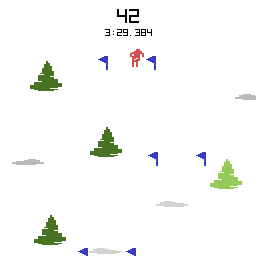

# Slalom



Slalom is a ski game for [RIVES](https://rives.io), a remake of [Skiing](<https://en.wikipedia.org/wiki/Skiing_(Atari_2600_video_game)>), designed by [Bob Whitehead](https://en.wikipedia.org/wiki/Bob_Whitehead) and published by [Activision](https://en.wikipedia.org/wiki/Activision) for the Atari platform.

The goal is to reach the finish line as fast as possible, avoiding trees. Miss a gate and you'll get a 5 seconds time penalty.

It was developed for the [RIVES Jam #3](https://itch.io/jam/rives-jam-3).

Controls:

Left and right keys: turn the skier.

## Building

After [installing RIV SDK](https://rives.io/docs/riv/developing-cartridges#installing-the-riv-sdk), you can build the game by running the following command:

```shell
make
```

## Running

```shell
make run
```

## Configuration

The difficulty of the game can be adjusted by passing the following argument:

```
--gate-width 48
```

This will control how far apart are the gate poles.

```
--time-per-gate 5000
```

This will control how much time per gate is the maximum time to complete the course.

The cartridge is bundled with a default [track.txt](./track.txt), but in case other files are created the one to use can be passed as an argument:

```
--file <file>
```
